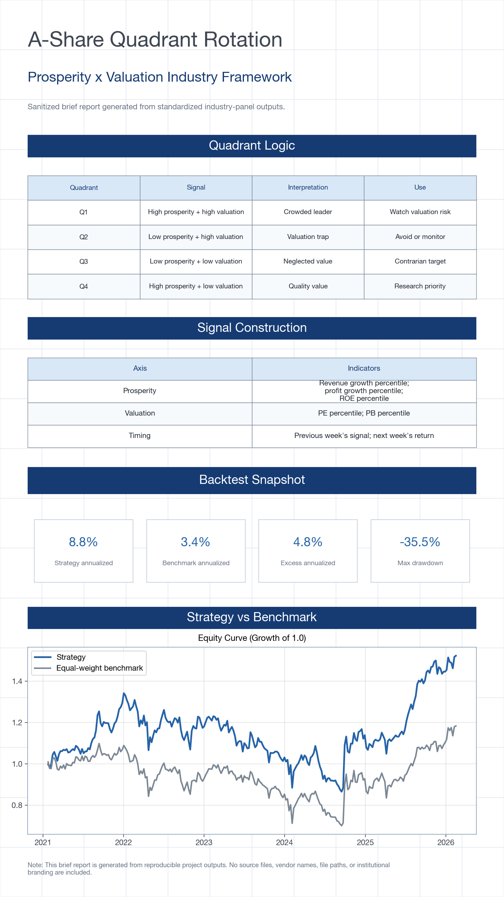

# A-Share Quadrant Rotation Reconstruction

This project reconstructs an A-share industry quadrant rotation workflow using modular, reproducible code. Data inputs are handled locally and are not included in the repository.

## Brief



## Question

Can A-share industry allocation decisions be structured through a two-dimensional framework of prosperity and valuation?

## Core Logic

The reconstruction follows this workflow:

1. Build industry-level prosperity indicators from revenue growth, profit growth, and ROE.
2. Build industry-level valuation indicators from PE and PB percentiles.
3. Convert daily signals to weekly decision dates.
4. Classify industries into four quadrants.
5. Select a target quadrant using the previous week's signal.
6. Evaluate next-week industry returns against an equal-weight industry benchmark.
7. Report performance, latest quadrant distribution, and week-over-week migration.

## Quadrants

| Quadrant | Prosperity | Valuation |
|---|---:|---:|
| High prosperity / high valuation | > 0.5 | > 0.5 |
| High prosperity / low valuation | > 0.5 | <= 0.5 |
| Low prosperity / high valuation | <= 0.5 | > 0.5 |
| Low prosperity / low valuation | <= 0.5 | <= 0.5 |

## Run

The default run uses deterministic synthetic A-share industry data to test the full pipeline.

A private validation version of this project was developed with restricted local A-share industry datasets. The public repository uses deterministic synthetic data to preserve reproducibility while respecting data licensing and confidentiality constraints.

```bash
python3 scripts/run_quadrant_rotation.py --data-source sample
```

The same pipeline can be connected to external industry panels once the input files are standardized.

## Generated Outputs

```text
outputs/a_share_<target_quadrant>_weekly_returns.csv
outputs/a_share_<target_quadrant>_backtest_summary.csv
outputs/latest_quadrants.csv
outputs/quadrant_migration.csv
outputs/figures/a_share_<target_quadrant>_equity_curve.png
```
