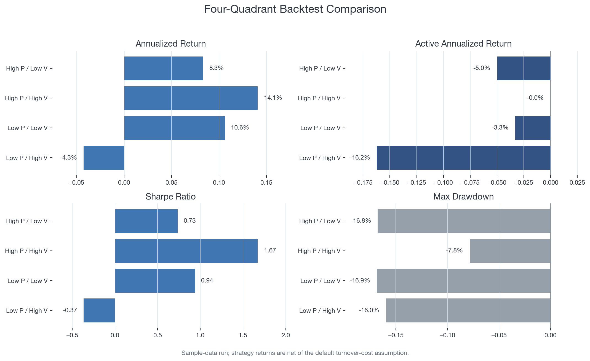
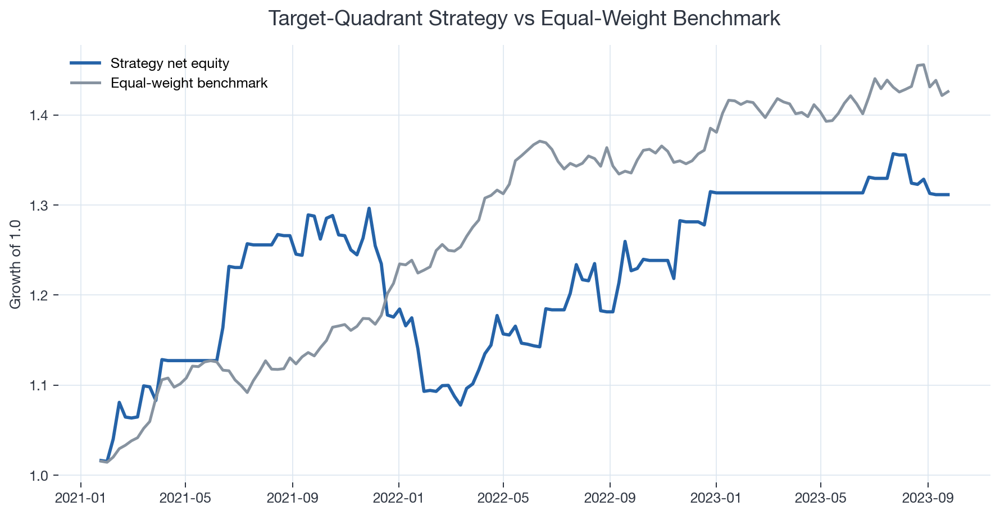

# A-Share Quadrant Rotation

Reproducible reconstruction of an A-share industry rotation workflow using prosperity and valuation signals.

The public version runs on deterministic synthetic data. A private validation version was developed with restricted local A-share industry panels.

## Results

Sample-data run:





## Pipeline

1. Build prosperity scores from revenue growth, profit growth, and ROE percentiles.
2. Build valuation scores from PE and PB rolling percentiles.
3. Classify industries into four prosperity-valuation quadrants.
4. Backtest next-week industry returns against an equal-weight benchmark.
5. Compare quadrant performance, drawdown, active return, and turnover.

## Run

```bash
python3 scripts/run_quadrant_rotation.py --data-source sample
python3 scripts/generate_readme_figures.py --target-quadrant low_low
```

## Notes

- High prosperity / low valuation is treated as a testable hypothesis, not an assumed winner.
- Signals use each industry's own trailing percentiles.
- Previous week's signal selects the portfolio; returns are evaluated from the next weekly price point to the following one.
- Empty target weeks are treated as cash holdings.
- Default transaction-cost assumption is `10 bps * one-way turnover`.
- Sharpe ratio uses a configurable annual risk-free-rate assumption; default is `0`.

## Generated Outputs

```text
outputs/a_share_<target_quadrant>_weekly_returns.csv
outputs/a_share_<target_quadrant>_backtest_summary.csv
outputs/a_share_<target_quadrant>_calendar_year_returns.csv
outputs/quadrant_comparison.csv
outputs/latest_quadrants.csv
outputs/quadrant_migration.csv
outputs/figures/a_share_<target_quadrant>_equity_curve.png
```
